# 课堂助手

该课堂教学辅助APP分为学生端和教师端。这两部分又分别含有用户登陆模块、班级维护模块、课堂提问模块、课堂点名模块、课后作业模块、通知公告模块、问题讨论模块。

## 软件功能图

1. 学生端

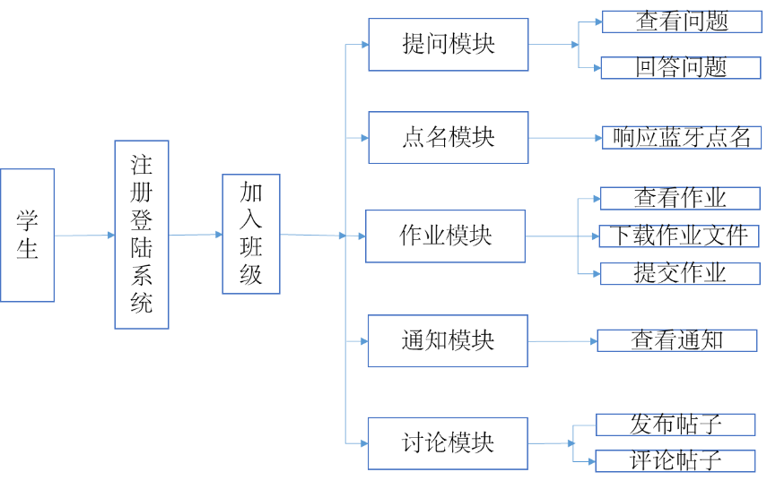

2. 教师端

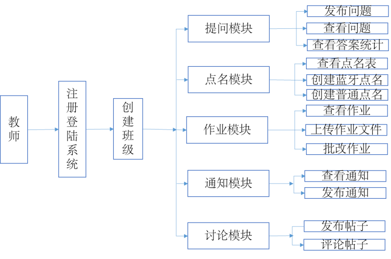

## 系统工作流程

1. 教师客户端

教师客户端的数据库操作主要有：增加或删除班级记录、增加或删除提问记录、增加点名记录、增加发布作业记录、增加帖子和评论记录等。

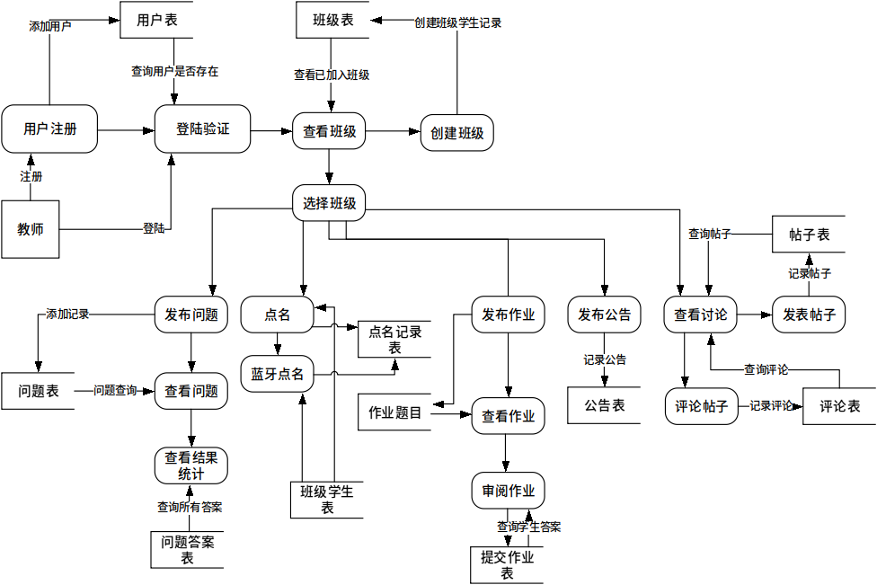

2. 学生客户端

学生客户端的数据库操作主要有：增加或删除班级学生记录、增加或删除提问回答记录、增加提交作业记录、增加帖子和评论记录等。

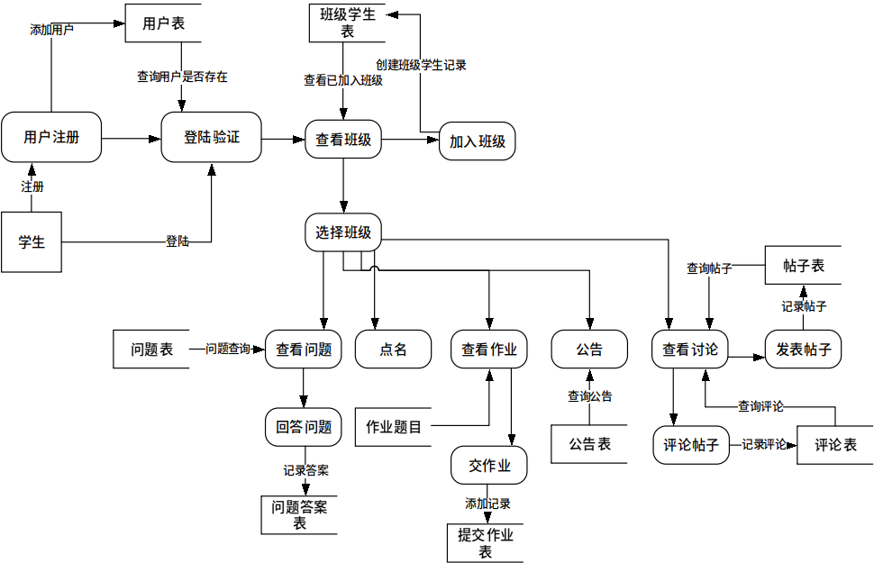

## 数据库设计

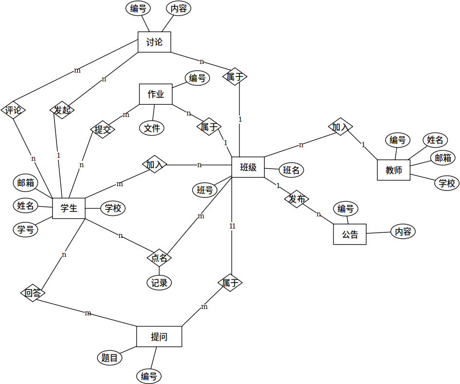

## 运行示例

###  用户登陆及用户信息管理

1. 注册登陆

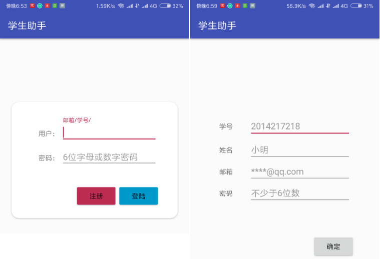

2. 主界面

3. 用户信息设置

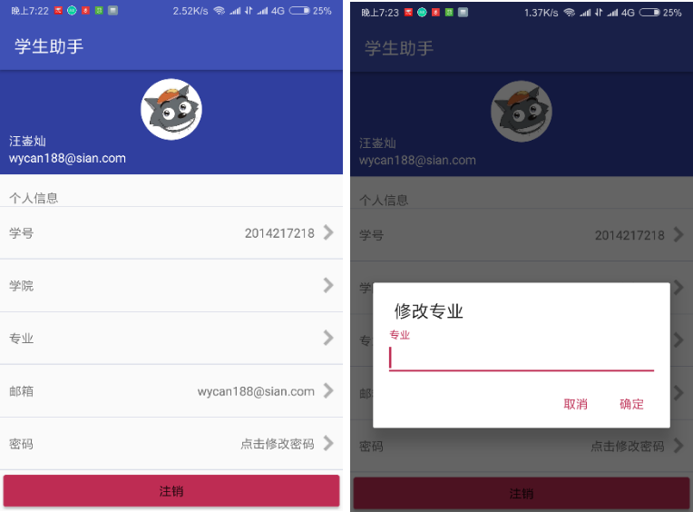

### 班级维护功能展示

1.  教师端新建班级

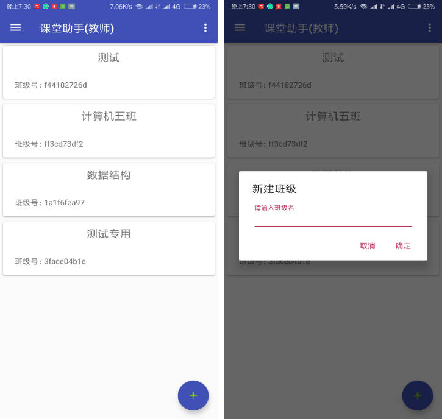

2. 学生端加入班级

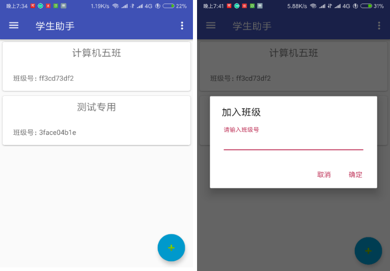

3. 班级功能界面

### 课堂提问功能展示

1. 教师端发布题目

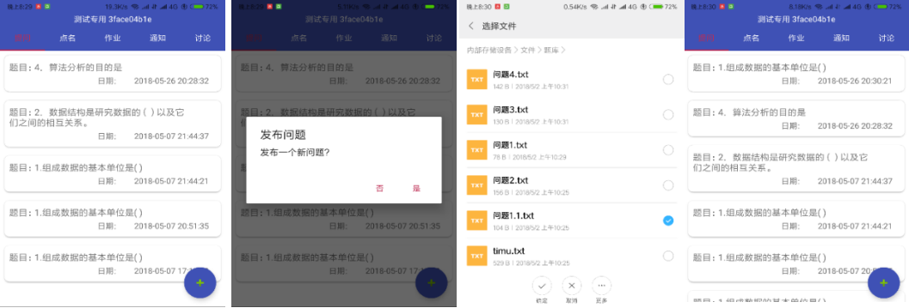

2. 学生端回答题目

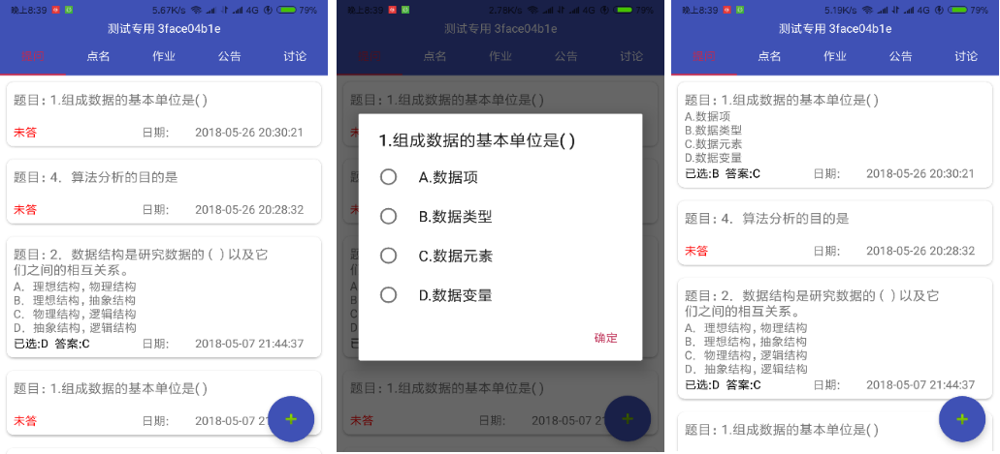

3. 教师端查看答案统计

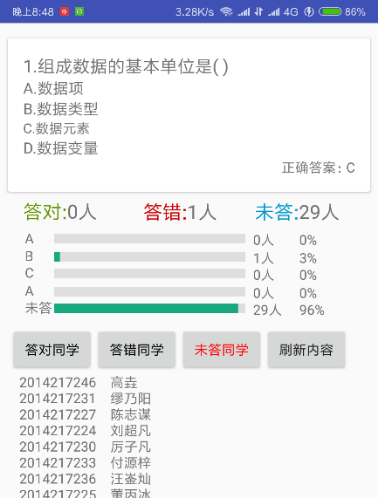

### 课堂点名功能展示

1. 教师端创建普通点名表

2. 蓝牙点名功能

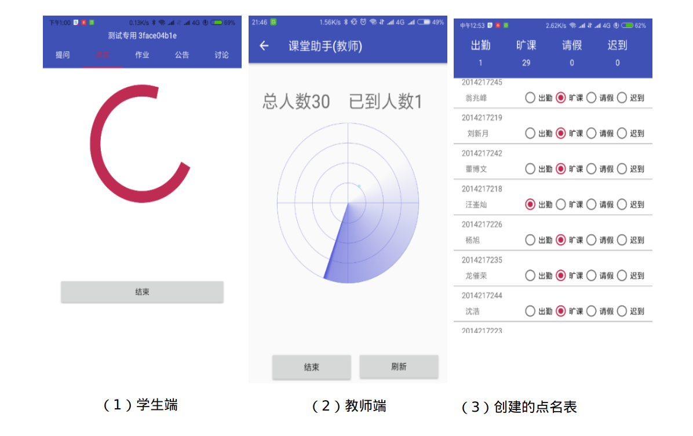

### 课后作业功能展示

1. 教师端发布作业

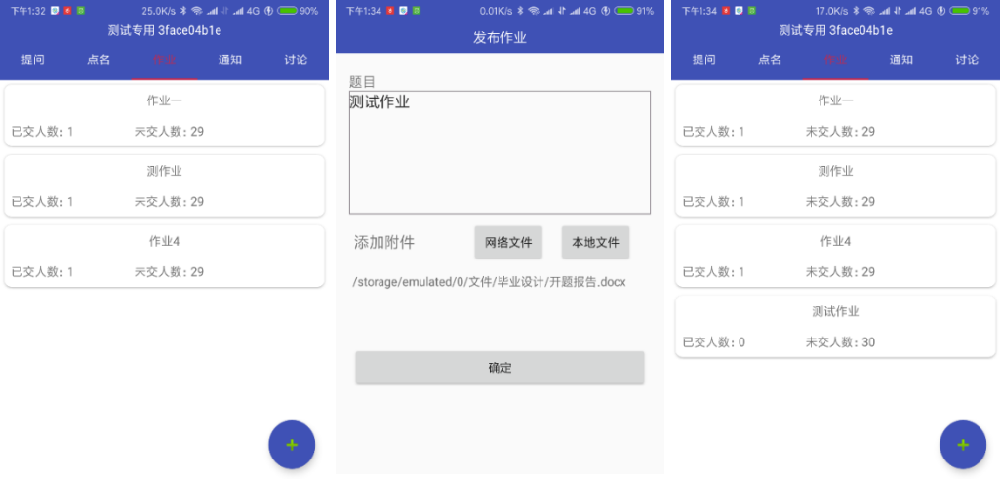

2. 学生端下载作业和上交作业

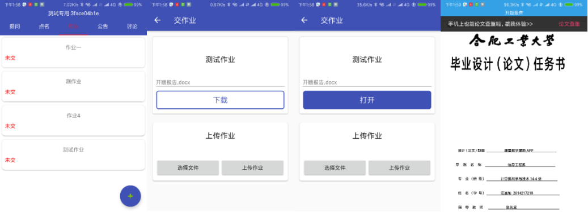

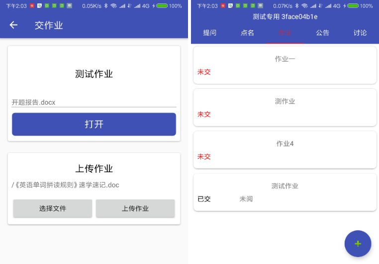

3. 教师端查看作业和打分

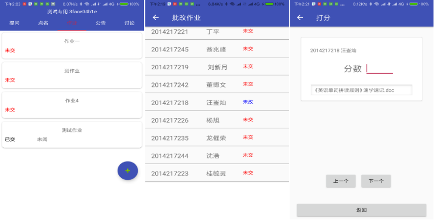

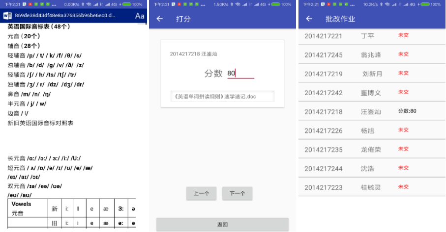

### 通知公告功能展示

1. 教师端发布公告

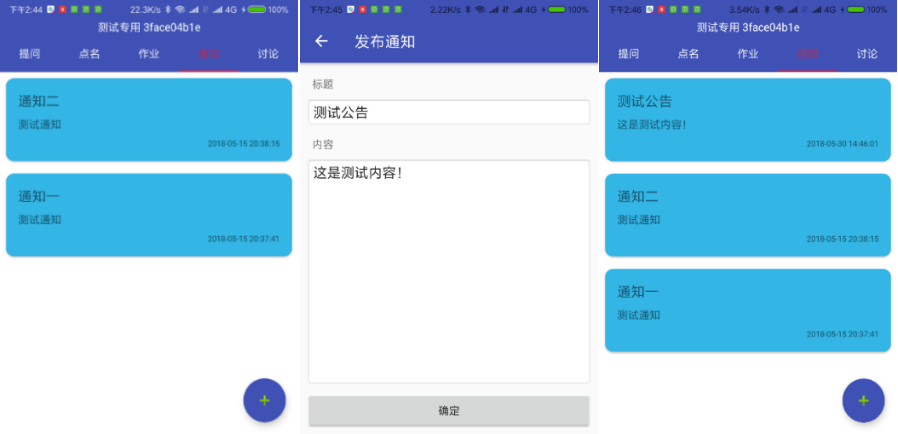

2. 学生端查看公告

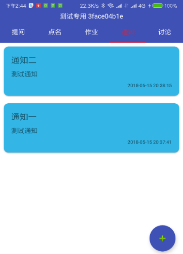

3. 课后讨论功能展示

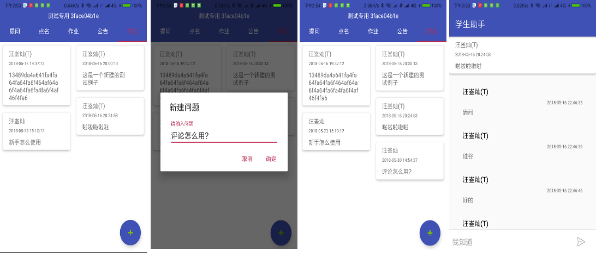

